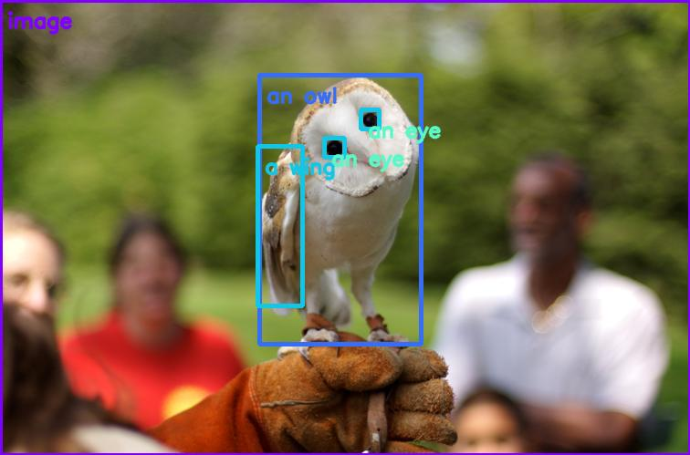

# Open-Vocabulary Detection and Classification
Demo is running on Jetson Orin Nano 8 Gb


## Introduction

This example shows how to use the OWL-Vit and CLIP to perform object detection and classification on an image/video using input text prompts. 

## Setup 
1. Clone this repo 
```
git clone https://github.com/affanrasheed/GenerativeAI_on_Jetson.git
cd GenerativeAI_on_Jetson/Open_Vocabulary_Detection
```
2. Install dependencies

	a. Install PyTorch
	
	b. Install [torch2trt](https://github.com/NVIDIA-AI-IOT/torch2trt)
	```
	git clone https://github.com/NVIDIA-AI-IOT/torch2trt
	cd torch2trt
	python setup.py install --user
	cd ..
	```
	
	c. Install NVIDIA TensorRT
	
	d. Install the Transformers library
	```
	python3 -m pip install transformers
	```
	
	e. Install the NanoOWL package
	```
	python3 setup.py develop --user
	```
	
	f. Install tensorflow
	```
	pip3 install tensorflow
	```
	
	g. Install clip
	```
	git clone https://github.com/openai/CLIP.git
	cd CLIP
	pip install -r requirements.txt
	cd ..
	```
	
	h. Install other dependencies
	```
	pip3 install aiohttp
	```
3. Build the TensorRT engine for the OWL-ViT vision encoder
```
mkdir -p data
python3 -m nanoowl.build_image_encoder_engine \
        data/owl_image_encoder_patch32.engine
```

## OpenVocabulary Detection Testing
Execute this command
```
python3 tree_predict.py \
    --prompt="[an owl [a wing, an eye]]" \
    --threshold=0.15 \
    --image_encoder_engine=../data/owl_image_encoder_patch32.engine
```
By default the output will be saved to ``owl_glove_out.jpg``

## OpenVocabulary Detection Demo

To launch the openvocabulary demo on its own, you can run the tree_demo.py script. Make sure camera is connected with the device: 

```
python3 tree_demo.py 
```

Once the script is launched, the UI will become available at ```http://localhost:7860```


